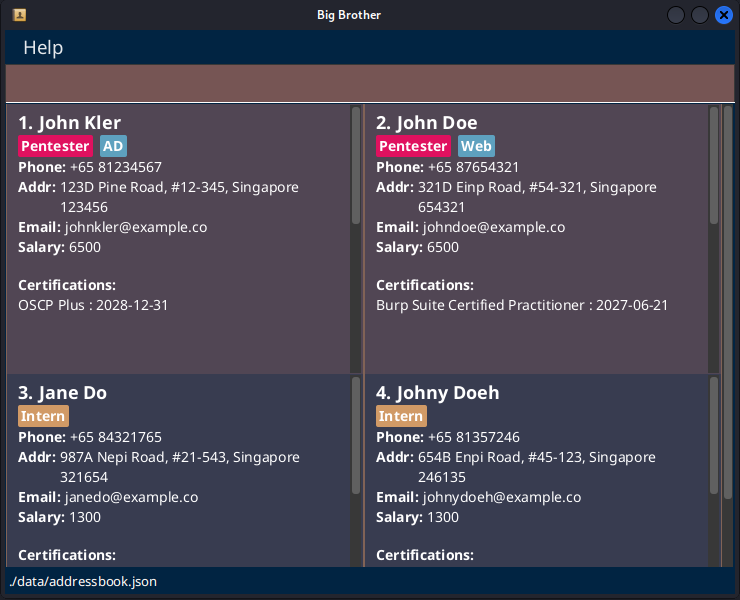
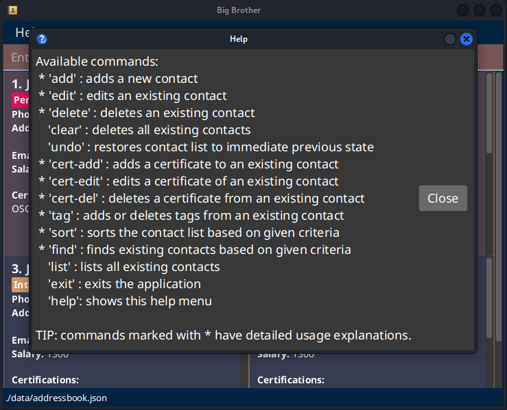
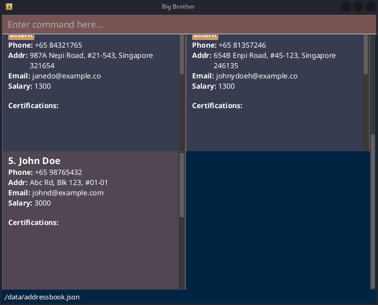

# Big Brother User Guide

Big Brother is a desktop app for Human Resources to manage employee contacts, optimized for use via typing in a Command Line Interface (CLI) command box, while displaying the contacts efficiently via a Graphical User Interface (GUI).

<!-- * Table of Contents -->
<page-nav-print />

--------------------------------------------------------------------------------------------------------------------

## Quick start

1. Ensure you have Java `17` installed in your Computer. 
   You may find instructions on how to do so for your operating system version [here](https://se-education.org/guides/tutorials/javaInstallation.html). 
   **Mac users:** Ensure you have the precise JDK version prescribed [here](https://se-education.org/guides/tutorials/javaInstallationMac.html).

1. Download the latest `.jar` file from [here](https://github.com/AY2526S2-CS2103T-T09-1/tp/releases).

1. Copy the file to the folder you want to use as the _home folder_ for Big Brother.

1. Open a command terminal (you can search for it in the start menu) and change the working folder to the one you put the app in. All operating systems support this with the `cd` command: 
   **Windows** `cd C:\Users\your_username\big_brother_home_folder` 
   **Linux** `cd /home/your_username/big_brother_home_folder` 
   **Mac** `cd /Users/your_username/big_brother_home_folder` 

1. Run the `java -jar bigbrother.jar` command to start the app. 
   Note the app name may be slightly different due to versions. 
   A GUI similar to the below should appear in a few seconds. 

   

1. Type a command in the command box (the red-brown rectangle at the top) and press Enter to execute it. 
* Refer to the [Features](#features) below for details of each command. 
* Refer to the [Input Validation, Duplicate Handling and Utilities](#input-validation-duplicate-handling-and-utilities) below to determine valid inputs, duplication rules and app utilities to help with usage. 
* Refer to the [Summary](#command-summary) below for a summary of all available commands.

--------------------------------------------------------------------------------------------------------------------

## Features

<box type="info" seamless>

**Notes about the command format:** 

* Words in `UPPER_CASE` are the parameters to be supplied by the user. 
  e.g. for `n/NAME`, `NAME` is the parameter.

* Arguments not in square brackets are compulsory. 
  e.g. `n/NAME`, `INDEX`

* Arguments in square brackets are optional. More explanations will be provided where they appear. 
  e.g. `[a/TAGS_TO_ADD]`, `[d/TAGS_TO_DELETE]`

* Parameters can be in any order. 
  e.g. if the command specifies `n/NAME p/PHONE`, `p/PHONE n/NAME` is also acceptable.

* Multiple prefixes must be separated by whitespaces. 
  e.g. if the command specifies `n/NAME p/PHONE`, `n/NAMEp/PHONE` is not acceptable.

* Prefix symbol and `/` **cannot** be separated by whitespaces. 
  e.g. if the command specifies `n/NAME`, `n /NAME` is not acceptable.

* Extraneous parameters for commands that do not take in parameters (such as `help`, `list`, `exit` and `clear`) will be ignored. 
  e.g. if you input `help 123`, it will interpreted as just `help`.

* If you are using a PDF version of this document, be careful when copying and pasting commands that span multiple lines as space characters surrounding line-breaks may be omitted when copied over to the application.
</box>

### Navigating the GUI
* The GUI is structured such that the main contacts list is a big scrollable section, and the contact entries are smaller scollable sections.

* You can hover your mouse cursor over the desired scroll bar, then scroll each section independently.

* If you perform any commands that modify the contact list or contact details, all the scroll bars will automatically jump back to the top.

* Mouseless-support is planned to be implemented in a future update.

### Viewing in-app help menu : `help`
Format: `help`

<box type="tip" seamless>

**Tips for in-app help**

> You can automatically close the popups with Enter on Windows and Linux, or Spacebar on Mac. 

> If you need more help with a command marked by a `*`, enter it with no arguments into the command box.
> Example: to get more help for `add`, enter `add` into the command box.
</box>

 

### Adding a new contact : `add`
Format: `add n/NAME [p/PHONE] [e/EMAIL] [a/ADDRESS] [s/SALARY]`
* all four of the optional fields may be omitted

Example: `add n/John Doe p/+65 98765432 e/johnd@example.com a/Abc Rd, Blk 123, #01-01 s/3000`

Expected result (starting with the existing sample data):

<box type="tip" seamless>

**Tip on navigation**

> As the app automatically resets the scroll bar to the top after the command, you will need to scroll down to see the newly added entry.
</box>

<box type="info" seamless>

Examples:
* `add n/John Doe p/+65 98765432 e/johnd@example.com a/John street, block 123, #01-01 s/`
* `add n/Betsy Crowe s/ e/betsycrowe@example.com a/Newgate Prison p/+81 1234567`

 

### Editing an existing contact : `edit`
Format: `edit INDEX [n/NAME] [p/PHONE] [e/EMAIL] [a/ADDRESS] [s/SALARY]`

* Edits the person at the specified `INDEX` of the displayed person list.
* **At least one of the optional fields must be provided.**
* Existing values will be updated to the input values.
* Warning: inputting an empty value for a prefix would result in that value being deleted.
* Input values can be the same as existing values (e.g. if person with `INDEX` 2 already has `SALARY` of `3000`, user can still perform `edit 2 s/3000`)

Example: `edit 1 p/+017 91234567 e/johndoe@example.com`

* Edits the phone to `+017 91234567` and the email to `johndoe@example.com` for the first person.

 

### Deleting an existing contact : `delete`
Format: `delete INDEX`

* Deletes the person at the specified `INDEX` of the displayed person list.

Examples:
* `list` followed by `delete 2` deletes the 2nd person in the address book.
* `find n/Betsy` followed by `delete 1` deletes the 1st person in the results of the `find` command, if present.

 

### Searching contacts by criteria : `find`
Format: `find [n/NAME] [t/TAG] [c/CERT_NAME] [e/CERT_EXPIRY_DATE]`

* Finds persons based on the given criteria.
  1. `list` followed by `delete 2` deletes the second person in the results of the `list` command.
  2. `find n/John` followed by `delete 1` deletes the first person in the results of the `find` command.
* **At least one of the optional fields must be provided.**
* For `NAME`, `TAG` and `CERT_NAME`, the match is case-insensitive and can match part of the word.
  * e.g. 'john' will match 'Johny'
* For `CERT_EXPIRY_DATE`, the match is for certificates that expire **before** the provided date.
* A field can be used more than once to expand the search (i.e. `OR` search), except for `CERT_EXPIRY` (see Ex 1).
  * Use repeated fields, not spaces, for `OR` (i.e. `find t/HR t/IT` and not `find t/HR IT`)
* Multiple fields can be used to narrow down the search (i.e `AND` search) (see Ex 3).

Examples:
1. `find n/Alex Y n/David` returns all persons whose name contains `Alex Y` or `David`.
2. `find c/OSCP` returns all persons with certificate names containing `OSCP`.
3. `find n/Alex t/IT e/2027-03-15` returns all persons whose name contains `Alex`, with tags that contain `IT` and with certificates that expire before 15th March 2027.

 

### Listing all contacts : `list`
Format: `list`

 

### Sorting all contacts : `sort`
Format: `sort`
* Sorts currently displayed contact list in increasing alphabetical order.

 

### Adding and deleting tags : `tag`
Format: `tag INDEX [a/TAGS_TO_ADD] [c/COLOUR_OF_TAGS_TO_ADD] [d/TAGS_TO_DELETE]`

* Adds or deletes tags of the person at the specified `INDEX` of the displayed person list.
* **Either the `a/` or the `d/` field must be specified. Both fields cannot be specified at the same time.**
* If multiple tags are to be added or deleted, their names are to be separated by spaces.
* There are 5 colour options for `c/`: `RED`, `YELLOW`, `GREEN`, `BLUE` (default), and `PURPLE`.
  * case-insensitive, so `c/red` and `c/RED` are both valid
* When adding, specifying the optional `c/` field applies the colour to all tags that are being added.
* When only deleting, do not use the `c/` field.

Examples:
1. `tag 1 a/IT Intern c/RED` adds two tags `IT` and `Intern` with a **RED** colour.
2. `tag 1 d/Best_Employee` deletes a tag `Best_Employee`.
3. `tag 1 a/HR Best_Employee` adds two tags `HR` and `Best_Employee` with the default colouration.

 

### Adding certificates : `cert-add`
Format `cert-add INDEX n/CERT_NAME e/CERT_EXPIRY_DATE`
* Adds a Certificate to a person at the specified `INDEX`.
* A Certificate must have both a name and an expiry date.
* Expiry dates must be formatted as **YYYY-MM-DD**.

Example: `cert-add 1 n/OSCP e/2028-03-05`
* Adds a certificate named OSCP with an expiry date on 5th March 2028 to the first person in the list.

<box type="info" seamless>

</box>

 

### Deleting certificates : `cert-del`
Format `cert-del INDEX [n/CERT_NAME]`
* Deletes a Certificate from a person at the specified `INDEX`.
* The Certificate to be deleted is specified by only its name.

Example: `cert-del 1 n/OSCP`
* Deletes the certificate named OSCP from the first person in the list.

 

### Editing certificates : `cert-edit`
Format: `cert-edit INDEX n/CERT_NAME [ne/NEW_CERT_NAME] [ee/NEW_CERT_EXPIRY_DATE]`

* Edits a certificate of the person at the specified `INDEX` of the displayed person list.
* The Certificate to be edited is specified by its name using the `n/` parameter.
* Either the `ne/` and/or the `ee/` flags must be included, depending on whether the name or the expiry date has to be edited.
* Overwriting a Certificate with the same CERT_NAME and CERT_EXPIRY_DATE is allowed.

Example: `cert-edit 1 n/OSCP ne/OSCP2`
* Edits the certificate originally named 'OSCP' held by the first person in the list, updating its name to 'OSCP2'.

 

### Restoring the contact list : `undo`
Format: `undo`

* Undos the last used command.

<box type="warning" seamless>

> **CAUTION:**
> * Limited to undoing **exactly one command** to restore the contact list to the immediate previous state.
> * Will do nothing if there is no change in previous state (e.g. just restarted the app; consecutive attempts to undo; after calling the `list`, `find` or `sort` commands).

</box>

### Sorting employee profiles : `sort`
Format: `sort`

* Sorts the employee profile list by alphabetical order of names.

<box type="warning" seamless>

> **CAUTION:**
> * Executing `sort` will rearrange the employee profiles in the save file.
> * This is intentional for convenience and preventing having to execute `sort` repeatedly if nothing has changed.

</box>

<box type="info" seamless>

> Tip: if the above behaviour is undesired, you can run `undo` immediately to restore the previous order.

</box>

 
  
### Clearing all entries : `clear`
Format: `clear`

<box type="info" seamless>

> Tip: if you accidentally ran `clear`, you can run `undo` to restore your immediate previous contact list.

</box>

 

### Exiting the program : `exit`
Format: `exit`

 

### Accessing the offline help menu : `help`
Format: `help`

<box type="info" seamless>

> Tip: If you cannot access the user guide, you can use the `help` command to know what commands are available. Commands marked with `*` have detailed usage explanations, which you can view by running the command itself with no other inputs (e.g. just `cert-add`)

</box>

 

## Input Validation, Duplicate Handling and Utilities
| Parameter        | Input Validation                                                                                                                                                                                                                                                                                                                                                                                                                                                                                                                                            | Duplicate Handling                   | Whitespace Trimming Utility                                                                                                                                                                                                                                |
|------------------|-------------------------------------------------------------------------------------------------------------------------------------------------------------------------------------------------------------------------------------------------------------------------------------------------------------------------------------------------------------------------------------------------------------------------------------------------------------------------------------------------------------------------------------------------------------|--------------------------------------|------------------------------------------------------------------------------------------------------------------------------------------------------------------------------------------------------------------------------------------------------------|
| NAME             | 1. Cannot be empty 2. Only letter, whitespaces and forward slash 3. Letters immediately beside forward slash must be uppercase (e.g. `S/O`)                                                                                                                                                                                                                                                                                                                                                                                                          | case-*insensitive* comparison        | 1. Leading, trailing and internal whitespaces for `/` will be trimmed (e.g.   `S   /  O` will be trimmed to `S/O`).   2.Internal whitespaces between words will be trimmed to 1.                                                                       |
| PHONE            | 1. Can be empty 2.  `+` then immediately followed by COUNTRY_CODE(1 to 3 digits) followed by space followed by PHONE(3 to 15 digits)                                                                                                                                                                                                                                                                                                                                                                                                                 | digits and whitespaces match exactly | 1. Leading and trailing whitespaces will be trimmed. 2. Internal whitespaces between `+` and COUNTRY_CODE will be trimmed.  3. Internal whitespaces in PHONE will be trimmed to 1. (e.g. ` +  33 22 34 55 ` will be trimmed to `+33 22 34 55`) |
| EMAIL            | 1. Can be empty 2.  Emails should be of the format `local-part@domain`, where `local-part` should: a .contain only alphanumeric characters and `+_.-` b. not start or end with `+_.-`  c. not contain consecutive `+_.-` 3. and `domain` is made of domain labels where each should: a. be separated by `.` b. contain only alphanumeric characters and hyphens c. not contain consecutive hyphens d. start and end only with alphanumeric characters e. be at least 2 characters long for the last domain label  | case-*insensitive* comparison        | Leading, trailing and internal whitespaces will be trimmed.                                                                                                                                                                                                |
| ADDRESS          | 1. Can be empty 2.  Only alphanumeric characters, whitespaces and `#,-<`  3. At most 100 characters long                                                                                                                                                                                                                                                                                                                                                                                                                                            | case-*insensitive* comparison        | 1. Leading and trailing whitespaces will be trimmed.  2. Internal whitespaces will be trimmed to 1.                                                                                                                                                    |
| SALARY           | 1. Can be empty 2.  Only digits                                                                                                                                                                                                                                                                                                                                                                                                                                                                                                                         | digits match exactly                 | Leading, trailing and internal whitespaces will be trimmed.                                                                                                                                                                                                |
| TAG              | 1. Only alphanumeric characters and `!@#$?\|<>_*&:;=` 2. At most 30 characters long                                                                                                                                                                                                                                                                                                                                                                                                                                                                     | case-*sensitive* match               | Leading and trailing whitespaces will be trimmed.                                                                                                                                                                                                          |
| CERT_NAME        | 1. Only alphanumeric characters and whitespaces                                                                                                                                                                                                                                                                                                                                                                                                                                                                                                         | case-*sensitive* match               | 1. Leading and trailing whitespaces will be trimmed.  2. Internal whitespaces will be trimmed to 1.                                                                                                                                                    |
| CERT_EXPIRY_DATE | 1. Must follow format `YYYY-MM-DD` 2. Must be a valid date.                                                                                                                                                                                                                                                                                                                                                                                                                                                                                         | same `YYYY-MM-DD`                    | Leading and trailing whitespaces will be trimmed.                                                                                                                                                                                                          |
| INDEX            | 1. Must be a positive integer (e.g. 1) 2. No internal whitespaces are allowed (e.g. if contact list has a person with index `10`, INDEX `10` is valid while `1 0` is invalid)                                                                                                                                                                                                                                                                                                                                                                           | N.A.                                 | Leading and trailing whitespaces will be trimmed.                                                                                                                                                                                                          |

> **CAUTION**: When are 2 **persons** considered duplicates?  
> Possible right after executing [add](#adding-a-new-contact--add) or [edit](#editing-an-existing-contact--edit) commands 
> (1) `EMAIL` and `PHONE` are empty: duplicates if `NAME` are the same 
> (2) Else, 2 persons are duplicates if their `NAME` & `PHONE` & `EMAIL` are the same  
> **Good news**: there will be a warning pop-up message if duplicate persons are detected after executing a command. It is then up to you to delete duplicates.

> **CAUTION**: When are 2 **certificates** considered duplicates? 
> * Possible right after executing [cert-add](#adding-certificates--cert-add) or [cert-edit](#editing-certificates--cert-edit) commands 
> * Certificates are duplicates if `CERT_NAME` are duplicates. `CERT_EXPIRY_DATE` is not taken into account. 

 

### Saving the data
Big Brother data is saved in the hard disk automatically after any command that changes the data. There is no need to save manually.

### Editing the data file
Big Brother data is saved automatically as a JSON file `[JAR file location]/data/addressbook.json`. Advanced users are welcome to update data directly by editing that data file.

<box type="warning" seamless>

> **CAUTION:**  
> If your changes to the data file makes its format invalid, Big Brother will discard all data and start with an empty data file at the next run.  Hence, it is **recommended to make a manual backup of the file before editing it**. Support for the prevention of data loss in the event of corrupted or wrongly-formatted data is planned to be added in a future update.   
> Furthermore, certain edits can cause the Big Brother to behave in unexpected ways (e.g., if a value entered is outside the acceptable range). Therefore, edit the data file only if you are confident that you can update it correctly.

</box>

--------------------------------------------------------------------------------------------------------------------

## FAQ

**Q**: How do I transfer my data to another Computer? 
**A**: Install the app in the other computer and overwrite the empty data file it creates with the file that contains the data of your previous Big Brother home folder.

--------------------------------------------------------------------------------------------------------------------

## Known issues

1. **When using multiple screens**, if you move the application to a secondary screen, and later switch to using only the primary screen, the GUI will open off-screen. The remedy is to delete the `preferences.json` file created by the application before running the application again.
2. **If you minimize the Help Window** and then run the `help` command (or use the `Help` menu, or the keyboard shortcut `F1`) again, the original Help Window will remain minimized, and no new Help Window will appear. The remedy is to manually restore the minimized Help Window.

--------------------------------------------------------------------------------------------------------------------

## Command summary
|Format|
|------|
`add n/NAME [p/PHONE] [e/EMAIL] [a/ADDRESS] [s/SALARY]`
`edit INDEX [n/NAME] [p/PHONE] [e/EMAIL] [a/ADDRESS] [s/SALARY]`
`delete INDEX`
`clear`
`undo`
`cert-add INDEX n/CERT_NAME e/CERT_EXPIRY_DATE`
`cert-edit INDEX n/CERT_NAME [ne/NEW_CERT_NAME] [ee/NEW_CERT_EXPIRY_CERT]`
`cert-del INDEX n/CERT_NAME`
`tag INDEX [a/TAGS_TO_ADD] [c/COLOUR_OF_TAGS_TO_ADD] [d/TAGS_TO_DELETE]`
`sort`
`find [n/NAME] [t/TAG] [c/CERT_NAME] [e/CERT_EXPIRY_DATE]`
`list`
`exit`
`help`
