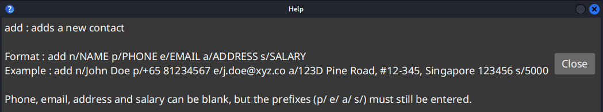

# Big Brother User Guide

Big Brother is a desktop app for managing employee contacts, optimized for use via a Command Line Interface (CLI) while displaying the contacts efficiently via a Graphical User Interface (GUI).

<!-- * Table of Contents -->
<page-nav-print />

--------------------------------------------------------------------------------------------------------------------

## Quick start

1. Ensure you have Java `17` installed in your Computer. 
   You may find instructions on how to do so for your operating system version [here](https://se-education.org/guides/tutorials/javaInstallation.html). 
   **Mac users:** Ensure you have the precise JDK version prescribed [here](https://se-education.org/guides/tutorials/javaInstallationMac.html).

1. Download the latest `.jar` file from [here](https://github.com/AY2526S2-CS2103T-T09-1/tp/releases).

1. Copy the file to the folder you want to use as the _home folder_ for Big Brother.

1. Open a command terminal (you can search for it in the start menu) and change the working folder to the one you put the app in. All operating systems support this with the `cd` command: 
   **Windows** `cd C:\Users\john\big_brother_home_folder` 
   **Linux** `cd /home/john/big_brother_home_folder` 
   **Mac** `cd /Users/john/big_brother_home_folder` 

1. Run the `java -jar bigbrother.jar` command to start the app. 
   Note the app name may be slightly different due to versions. 
   A GUI similar to the below should appear in a few seconds.  
   

1. Type a command in the command box (the red-brown box at the top) and press Enter to execute it.
   Some example commands you can try:

   * `help` : Pops up an in-app help menu of available commands.

   * `list` : Lists all contacts.

   * `add n/John Doe p/+65 98765432 e/johnd@example.com a/Abc Rd, Blk 123, #01-01 s/3000` : 
     Adds a new contact 'John Doe' with the given details (elaborated in the explanation for `add` [below](#adding-a-new-contact-add))

   * `delete 3` : Deletes the 3rd contact shown in the currently displayed list.

   * `clear` : Deletes all contacts. You can use this to clear the existing sample data.

   * `exit` : Exits the app.

1. Refer to the [Features](#features) below for details of each command.

--------------------------------------------------------------------------------------------------------------------

## Features

<box type="info" seamless>

**Notes about the command format:** 

* Words in `UPPER_CASE` are the parameters to be supplied by the user. 
  e.g. for `n/NAME`, `NAME` is the parameter.

* Items in square brackets are optional. More explanations will be provided where they appear. 
  e.g `tag INDEX [a/TAG_NAME] [d/TAG_NAME]`.

* `INDEX` **must be a positive integer** 1, 2, 3, ...

* Parameters can be in any order. 
  e.g. if the command specifies `n/NAME p/PHONE`, `p/PHONE n/NAME` is also acceptable.

* Extraneous parameters for commands that do not take in parameters (such as `help`, `list`, `exit` and `clear`) will be ignored. 
  e.g. if you input `help 123`, it will interpreted as just `help`.

* If you are using a PDF version of this document, be careful when copying and pasting commands that span multiple lines as space characters surrounding line-breaks may be omitted when copied over to the application.
</box>

### Navigating the GUI:
* The GUI is structured such that the main contacts list is a big scrollable section, and the contact entries are smaller scollable sections.

* You can hover your mouse cursor over the desired scroll bar, then scroll each section independently.

* If you perform any commands that modify the contact list or contact details, all the scroll bars will automatically jump back to the top.

* Mouseless-support in planned to be implemented in a future update.

### Viewing in-app help menu : `help`
Format: `help`

<box type="tip" seamless>

**Tips for in-app help**

> You can automatically close the popups with Enter on Windows and Linux, or Spacebar on Mac. 

> If you need more help with a command marked by a `*`, enter it with no arguments.
</box>

### Adding a new contact : `add`
Format: `add n/NAME p/PHONE_NUMBER e/EMAIL a/ADDRESS s/SALARY`

<box type="info" seamless>

**Validation & Duplicate-handling Rules**
> [**NAME**] 
> (1) **Cannot be empty** 
> (2) Only letter, spaces, forward slash 
> (3) Letters immediately closest to forward slash must be uppercase 
> Duplicate-handling: case-insensitive comparison 

> [**PHONE_NUMBER**] 
> (1) Can be empty 
> (2) `+` then immediately followed by COUNTRY_CODE followed by space followed by 3 to 15 digits phone number 
> Duplicate-handling: all digits match exactly 

> [**EMAIL**] 
> (1) Can be empty 
> (2) Emails should be of the format 'local-part@domain', where 'local-part' should: 
> * contain only alphanumeric characters and `+_.-` 
> * not start or end with `+_.-` 
> * not contain consecutive `+_.-` 
> (3) and 'domain' is made of domain labels where each should: 
> * be separated by `.`
> * contain only alphanumeric characters and hyphens
> * not contain consecutive hyphens
> * start and end only with alphanumeric characters
> * be at least 2 characters long for the last domain label 
> Duplicate-handling: exact match 

> [**ADDRESS**] 
> (1) Can be empty 
> (2) Only alphanumeric characters and `#,-` 
> (3) At most 100 characters long 
> Duplicate-handling: exact match 

> [**SALARY**] 
> (1) Can be empty 
> (2) Only digits 
> (3) No spaces between digits 
> Duplicate-handling: exact match 

> [**PERSON duplicate handling**] 
> (1) EMAIL and PHONE_NUMBER are empty: duplicates if NAMEs are the same 
> (2) Else, 2 persons are duplicates if their NAME & PHONE_NUMBER & EMAIL are the same 
</box>

Examples:
* `add n/John Doe p/+65 98765432 e/johnd@example.com a/John street, block 123, #01-01 s/`
* `add n/Betsy Crowe s/ e/betsycrowe@example.com a/Newgate Prison p/+81 1234567`

 

### Editing an existing contact : `edit`
Format: `edit INDEX [n/NAME] [p/PHONE] [e/EMAIL] [a/ADDRESS] [s/SALARY]`

* Edits the person at the specified `INDEX` of the displayed person list.
* **At least one of the optional fields must be provided.**
* Existing values will be updated to the input values.
* Input values can be the same as existing values (e.g. if person with `INDEX` 2 already has `SALARY` of `3000`, user can still perform `edit 2 s/3000`)

Examples:
*  `edit 1 p/+017 91234567 e/johndoe@example.com` Edits the phone number and email address of the 1st person to be `+017 91234567` and `johndoe@example.com` respectively.
*  `edit 2 n/Betsy Crower` Edits the name of the 2nd person to be `Betsy Crower`.

 

### Deleting an existing contact : `delete`
Format: `delete INDEX`

* Deletes the person at the specified `INDEX` of the displayed person list.

Examples:
* `list` followed by `delete 2` deletes the 2nd person in the address book.
* `find n/Betsy` followed by `delete 1` deletes the 1st person in the results of the `find` command, if present.

 

### Searching contacts by criteria: `find`

Finds persons based on the given criteria.

Format: `find [n/NAME] [t/TAG] [c/CERT_NAME] [e/CERT_EXPIRY_DATE]`

* At least one of the optional fields must be provided to search with
* The search is case-insensitive
* Partial words will be matched
* Multiple values of the same field can be used to expand the search (i.e. `OR` search),
except for `CERT_EXPIRY`.
* Multiple fields can be used to narrow down the search (i.e `AND` search)

Examples:
* `find n/Alex Y n/David` returns all persons whose name contains `Alex Y` or `David`
* `find c/OSCP` returns all persons with certificate names containing `OSCP`
* `find n/Alex t/IT e/2027-03-15` returns all persons whose name contains `Alex`, with tags that contain `IT` and with certificates that expire **before** 15th March 2027.

 

### Listing all contacts : `list`
Format: `list`

 

### Adding and deleting tags of a contact: `tag`
Format: `tag INDEX [a/TAGS TO ADD SEPARATED BY SPACE] [c/COLOUR OF TAGS TO BE ADDED] [d/TAGS TO DELETE SEPARATED BY SPACE]`

* Add or delete tags of the person at the specified `INDEX` of the the displayed person list.
* If multiple tags are to be added or deleted, they are to be separated by spaces.
* There are 5 colour options for Tags: `RED`, `YELLOW`, `GREEN`, `BLUE`, `PURPLE`, the default colour is `BLUE`
* **At least one of the `a/` or `d/` fields must be provided.** There is no need to have `c/` when only deleting tags

Examples:
* `tag 1 a/IT Intern c/red` adds two Tags `IT` and `Intern` with a **RED** Colouration
* `tag 1 d/Best_Employee` deletes a Tag `Best_Employee`
* `tag 1 a/HR Best_Employee d/IT` adds two Tags `HR` and `Best_Employee`, while deleting `IT`

<box type="info" seamless>

**Validation & Duplicate-handling Rules**

(1) Only alphanumeric characters and `!@#$?/|<>_*&:;=` 
(2) At most 30 characters long 
Duplicate-handling: exact match
</box>

 

### Adding certificates : `cert-add`

Adds a Certificate to a person in the address book.

Format `cert-add INDEX [n/CERT_NAME] [e/CERT_EXPIRY_DATE]`
* Adds a Certificate to a person at the specified `INDEX`.
* The index refers to the index number shown in the displayed person list.
* A Certificate must have both a name and an expiry date.
* Expiry dates must be formatted as **YYYY-MM-DD**.

Examples:
* `cert-add 1 n/OSCP e/2028-03-05` adds a Certificate named OSCP with an expiry date on 5th March 2028 to the first person in the list.

> Note that:
> - Certificate names are case-sensitive and limited to alphanumeric characters only.
> - Multiple instances of Certificates with the same name will be considered duplicates, even if the expiry dates are different.

 

### Deleting certificates : `cert-del`

Deletes a Certificate from a person in the address book.

Format `cert-del INDEX [n/CERT_NAME]`
* Deletes a Certificate from a person at the specified `INDEX`.
* The index refers to the index number shown in the displayed person list.
* The Certificate to be deleted is specified by only its name.

Examples:
* `cert-del 1 n/OSCP` deletes the OSCP certificate from the first person in the displayed person list.

 

### Editing certificates: `cert-edit`

Edit the details of a Certificate that a person in the address book holds.

Format: `cert-edit INDEX [n/CERT_NAME] [ne/NEW_CERT_NAME] [ee/NEW_CERT_EXPIRY_DATE]`
* Edits a Certificate that a person at the specified `INDEX` holds.
* The index refers to the index number shown in the displayed person list.
* The Certificate to be edited is specified by its name using the `n/` parameter.
* It is optional to include `ne/` and `ee/` flags, depending on whether the name or the expiry date has to be edited.
* It is possible to edit a certificate with details of an already existing certificate.

Examples:
* `cert-edit 1 n/OSCP ne/OSCP2` will edit the certificate originally named 'OSCP' held by the first person in the list, updating its name to 'OSCP2'.

 

### Clearing all entries : `clear`
Format: `clear`

> Tip: if you accidentally ran `clear`, you can run `undo` to restore your immediate previous contact list.

 

### Exiting the program : `exit`
Format: `exit`

 

### Accessing the offline help menu : `help`
Format: `help`

> Tip: If you cannot access the user guide, you can use the `help` command to know what commands are available. Commands marked with `*` have detailed usage explanations, which you can view by running the command itself with no other inputs (e.g. just `cert-add`)

 

### Saving the data
Big Brother data is saved in the hard disk automatically after any command that changes the data. There is no need to save manually.

### Editing the data file
Big Brother data is saved automatically as a JSON file `[JAR file location]/data/addressbook.json`. Advanced users are welcome to update data directly by editing that data file.

<box type="warning" seamless>

**Caution:** 
If your changes to the data file makes its format invalid, Big Brother will discard all data and start with an empty data file at the next run.  Hence, it is **recommended to make a manual backup of the file before editing it**.  
Furthermore, certain edits can cause the Big Brother to behave in unexpected ways (e.g., if a value entered is outside the acceptable range). Therefore, edit the data file only if you are confident that you can update it correctly.
</box>

--------------------------------------------------------------------------------------------------------------------

## FAQ

**Q**: How do I transfer my data to another Computer? 
**A**: Install the app in the other computer and overwrite the empty data file it creates with the file that contains the data of your previous Big Brother home folder.

--------------------------------------------------------------------------------------------------------------------

## Known issues

1. **When using multiple screens**, if you move the application to a secondary screen, and later switch to using only the primary screen, the GUI will open off-screen. The remedy is to delete the `preferences.json` file created by the application before running the application again.
2. **If you minimize the Help Window** and then run the `help` command (or use the `Help` menu, or the keyboard shortcut `F1`) again, the original Help Window will remain minimized, and no new Help Window will appear. The remedy is to manually restore the minimized Help Window.

--------------------------------------------------------------------------------------------------------------------

## Command summary
|Format|
|------|
`add n/NAME p/PHONE_NUMBER e/EMAIL a/ADDRESS s/SALARY`
`edit INDEX [n/NAME] [p/PHONE] [e/EMAIL] [a/ADDRESS] [s/SALARY]`
`delete INDEX`
`clear`
`undo`
`cert-add INDEX n/CERT_NAME e/CERT_EXPIRY`
`cert-edit INDEX n/NAME [ne/EDITED_NAME] [ee/EDITED_EXPIRY]`
`cert-del INDEX n/CERT_NAME`
`tag INDEX [a/TAGS TO ADD SEPARATED BY SPACE] [c/COLOUR OF TAGS TO BE ADDED] [d/TAGS TO DELETE SEPARATED BY SPACE]`
`sort ...`
`find [n/NAME] [t/TAG] [c/CERT_NAME] [e/CERT_EXPIRY_DATE]`
`list`
`exit`
`help`
